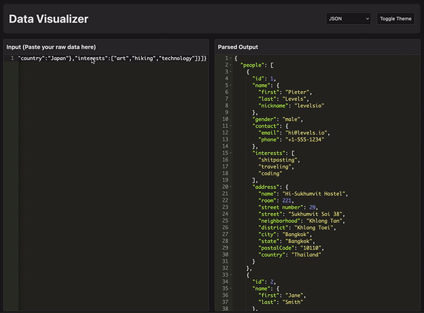

# Data Visualizer

Data Visualizer is a web-based tool designed to parse and display various data formats, including JSON, XML, PHP Serialized, Hexadecimal, Base64, and Binary. It provides a user-friendly interface for inputting raw data and viewing the parsed output in a readable format.

## Features

- **Multiple Data Formats**: Supports parsing of JSON, XML, PHP Serialized, Hexadecimal, Base64, and Binary data.
- **User-Friendly Interface**: Allows users to paste raw data into an input field and view the parsed output immediately.
- **Theme Toggle**: Offers a toggle option to switch between different themes for better readability.

## Usage

1. Navigate to the [Data Visualizer](https://dv.tr/datavis.html) page.
2. Paste your raw data into the "Input" field.
3. The parsed output will be displayed in the "Parsed Output" section.
4. Use the "Toggle Theme" button to switch between available themes.

## License

This project is licensed under the MIT License.
